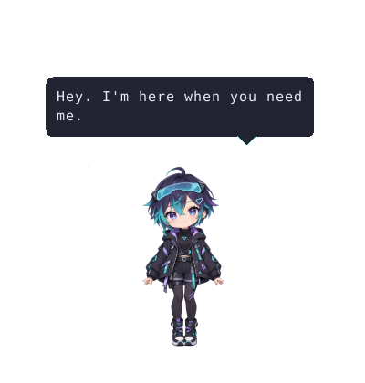

# Hypr Buddy

A desktop companion/mascot application for **CachyOS** with **Hyprland** (Wayland). A persistent animated character floats on top of all windows, reacts to desktop events, notifications, and active windows, speaks via TTS, and can hold conversations via LLM integration.



Shiro now uses a registered character illustration with continuous breathing, blinking,
speech motion, and gentle gestures. Start a voice session with a hotkey, speak naturally,
and continue after her reply. [Setup, controls, and validation](docs/companion-upgrade.md).

## Architecture

```
┌─────────────────────────────────────────────────────────────────────┐
│                          Desktop (Hyprland)                         │
│                                                                     │
│  ┌──────────────┐     ┌──────────────┐     ┌──────────────────────┐ │
│  │   Daemon     │────▶│    Brain     │────▶│      Overlay         │ │
│  │  (Python)    │     │  (Python)    │     │      (Rust)          │ │
│  │              │     │              │     │                      │ │
│  │ • Hyprland   │     │ • Personality│     │ • Layer-shell surface│ │
│  │   IPC events │     │ • Mood system│     │ • Sprite animation   │ │
│  │ • D-Bus      │     │ • Rule engine│     │ • Speech bubbles     │ │
│  │   notifs     │     │ • LLM chat   │     │ • Transparent overlay│ │
│  │ • System     │     │ • TTS engine │     │ • Input handling     │ │
│  │   monitors   │     │ • Proactive  │     │                      │ │
│  │              │     │   behavior   │     │                      │ │
│  └──────┬───────┘     └──────┬───────┘     └──────────┬───────────┘ │
│         │                    │                        │             │
│         │  Unix Socket       │  Unix Socket           │             │
│         │  (brain.sock)      │  (overlay.sock)        │             │
│         └────────────────────┘────────────────────────┘             │
│                                                                     │
│  ┌──────────────┐     ┌─────────────┐     ┌──────────────────────┐  │
│  │ SQLite DB    │     │ Config TOML │     │   Sprite Sheets      │  │
│  │ (~/.local/   │     │ (config/)   │     │   (assets/sprites/)  │  │
│  │  share/)     │     │             │     │                      │  │
│  └──────────────┘     └─────────────┘     └──────────────────────┘  │
└─────────────────────────────────────────────────────────────────────┘
```

### Data Flow

1. **Daemon** monitors Hyprland IPC, D-Bus notifications, and system state
2. Events are normalized to JSON and sent to the **Brain** via Unix socket
3. **Brain** processes events through the mood system and rule engine
4. Brain sends animation/speech commands to the **Overlay** via Unix socket
5. **Overlay** renders the sprite and speech bubbles on a Wayland layer-shell surface

## Prerequisites

- **CachyOS** (or any Arch-based distro)
- **Hyprland** (Wayland compositor with wlr-layer-shell support)
- **Python 3.11+**
- **Rust** (stable toolchain)
- **grim** and **slurp** (for screen-vision capability)
- **socat** (for IPC socket messaging)
- **Piper TTS** (optional, for speech output/TTS)
- **Ollama** (optional, for local LLM text/vision models)

## Installation

### Quick Install

The easiest way to get everything set up is using the install script:

```bash
git clone https://github.com/yourusername/hypr-buddy.git
cd hypr-buddy
./scripts/install.sh
```

The install script will:
1. Install required system packages (`wayland`, `rustup`, `grim`, `slurp`, `socat`, etc.) via `pacman`.
2. Set up the Rust toolchain.
3. Install Python dependencies inside your environment.
4. Build the Rust overlay binary (`overlay/target/release/hypr-buddy-overlay`).
5. Use the bundled Shiro artwork.
6. Download the default Piper voice model.

### Manual / Virtual Environment Setup

To keep your system python environment clean, we recommend setting up a virtual environment:

```bash
# 1. Install system dependencies
sudo pacman -S --needed --noconfirm wayland wayland-protocols python python-pip rustup gcc pkg-config grim slurp socat pipewire-audio ffmpeg alsa-utils

# 2. Set up Rust
rustup default stable

# 3. Create and activate a Python virtual environment
python3 -m venv venv
source venv/bin/activate

# 4. Install dependencies (standard or with optional voice support)
# Standard:
pip install -e .
# With voice/audio chat support:
pip install -e ".[voice]"

# 5. Build the Rust overlay
cd overlay && cargo build --release && cd ..

# 6. Character artwork is already bundled in assets/character/.

# 7. Download voice model (optional)
./scripts/setup_voice.sh
```

## Usage

### Start

```bash
./scripts/run.sh
```

This launches all three components as background processes. The buddy will appear in the bottom-right corner of your screen.

### Stop

```bash
./scripts/stop.sh
```

### Talk to Your Buddy

You can converse with your buddy via text prompt or voice chat. The brain uses your configured LLM (Ollama, Gemini, or Anthropic) to generate responses.

**Voice session (no textbox or terminal)**

Bind the script to a convenient key, adjusting the absolute repository path:

```ini
bind = $mainMod SHIFT, B, exec, /home/gato/repos/hypr-buddy/scripts/voice_chat.sh
```

Press the key, wait for “Listening…”, and speak. A brief pause ends your turn.
Shiro transcribes locally and replies aloud; listening resumes after playback finishes.
Press the key again to stop, including during a reply. Twenty seconds without speech
ends the session. The microphone closes during inference and playback. This is a
half-duplex session: interruption uses the hotkey, not spoken barge-in or a wake word.
Use `scripts/voice_chat.sh --once` for one spoken turn.

**Optional text chat**

```ini
bind = $mainMod, B, exec, /home/gato/repos/hypr-buddy/scripts/chat.sh
```

The text script supports fuzzel, wofi, rofi, bemenu, and zenity. `/model <provider> [model]`
and `/vision <provider> [model]` change providers; `/stop` interrupts the current turn.

Check dependencies and time a short local reply using the same Python environment as
`run.sh` (an existing `hypr-buddy` Conda environment takes precedence over `venv`):

```bash
python scripts/doctor.py --benchmark
```

### Send Overlay Commands Manually

You can also control the overlay directly for testing:

```bash
SOCK="$XDG_RUNTIME_DIR/hypr-buddy/overlay.sock"

# Make her say something
echo '{"cmd": "say", "text": "Hello world!", "state": "talking"}' | socat - UNIX-CONNECT:$SOCK

# Change emotional state
echo '{"cmd": "set_state", "state": "happy", "duration": 5.0}' | socat - UNIX-CONNECT:$SOCK

# Hide/show
echo '{"cmd": "visibility", "visible": false}' | socat - UNIX-CONNECT:$SOCK
```

## Configuration

All configuration is in the `config/` directory as TOML files.

### Character Personality (`config/buddy.toml`)

```toml
[character]
name = "Miku"
personality = "Friendly, slightly nerdy, encouraging..."
greeting_morning = "Good morning! Ready to take on the day?"
```

Customize the name, personality description, and time-based greetings. The personality description is used as context for LLM conversations.

### LLM Integration (`config/buddy.toml`)

Configure the LLM backend for your buddy. You can choose between local Ollama, Google Gemini, or Anthropic Claude.

```toml
[llm]
provider = "ollama"                 # "ollama", "gemini", or "anthropic"
model = "gemma4:e2b"                # Text generation model name
ollama_url = "http://localhost:11434"
max_tokens = 512                    # Token cap for cloud backends
```

- **Ollama (Local, Default):** Install [Ollama](https://ollama.ai), run the service, pull a text model (e.g., `ollama pull gemma4:e2b`), and configure it.
- **Google Gemini (Cloud):** Set `provider = "gemini"`, choose a model like `gemini-1.5-flash`, and save your API key in `~/.config/hypr-buddy/gemini_key`.
- **Anthropic Claude (Cloud):** Set `provider = "anthropic"`, choose a model like `claude-3-5-sonnet-20241022`, and save your API key in `~/.config/hypr-buddy/anthropic_key`.

### Screen Vision / Desktop Awareness (`config/buddy.toml`)

Your buddy can use screen capture tools (`grim`/`slurp`) to view what is currently on your screen (e.g., if you ask "look at my screen").

```toml
[vision]
enabled = true                      # Allows the buddy to look at your screen on demand
provider = "ollama"                 # "ollama", "gemini", or "anthropic"
model = "gemma4:e2b"                # Reuse the installed vision-capable text model

[vision.ambient]
enabled = false                     # Set to true to let the buddy look in the background
interval_sec = 300                  # Seconds between passive glances
only_active_monitor = true          # Capture only the currently focused monitor
```

### Window Following & Avoidance (`config/buddy.toml`)

Your buddy can automatically follow the active window and dodge the mouse cursor to stay out of your way.

```toml
follow_window = true                # If true, buddy follows active windows
follow_mode = "nearest_free"        # "nearest_free", "fixed", "random"
cursor_avoid_distance = 150         # Dodges cursor if it comes closer than 150px
```

### Event Monitoring (`config/events.toml`)

Control which desktop events the buddy reacts to:

```toml
[hyprland]
watch_activewindow = true   # React to app focus changes
watch_fullscreen = true     # Go quiet during fullscreen

[notifications]
enabled = true
ignore_apps = ["Spotify", "Discord"]  # Don't react to these

[ignore]
window_classes = ["polkit"]  # Ignore these window types
```

### Overlay Appearance (`config/overlay.toml`)

```toml
[window]
anchor = "bottom-right"     # Screen corner: bottom-right, bottom-left, top-right, top-left
margin_x = 50               # Distance from screen edge
margin_y = 50

[animation]
procedural = true          # Shiro rig, animated at 30 Hz
idle_fps = 8                # Legacy strip playback speed
talking_fps = 12            # Legacy talking strip playback speed
transition_ms = 180         # Crossfade duration between states
```

## Customization

### Custom Sprites

The default artwork lives in `assets/character/`. A single registered pose avoids
anatomy and silhouette jumps between frames. Only the eye patch changes for blinking;
breathing, gentle gestures, and mouth motion are rendered continuously. This is a
lightweight 2D rig, not a full skeletal or Live2D model. Face coordinates are registered
to this artwork in `overlay/src/sprite.rs`.

The original strips remain in `assets/sprites/`. Set `animation.procedural = false` to
use them. Legacy PNG strips can contain any number of square frames and are resized
to the configured display dimensions. Missing emotional states fall back to idle.

Generate a reproducible animated PNG using the actual renderer, without Wayland:

```bash
cargo build --release --manifest-path overlay/Cargo.toml
overlay/target/release/hypr-buddy-overlay --preview assets/previews/shiro.png
```

Artwork provenance and prompts: [assets/character/GENERATION.md](assets/character/GENERATION.md).

### Custom Reactions

Edit `brain/reactions.py` to add new reaction rules. Each rule specifies:

```python
(
    "event_type",                              # Event to match
    lambda data, mood: condition(data, mood),  # Match function
    [                                          # Possible responses
        {"state": "happy", "say": "Response text!"},
        {"state": "happy", "say": "Alternative response!"},
    ],
)
```

### Custom Proactive Lines

Edit `brain/proactive.py` and add to the `PROACTIVE_LINES` dictionary.

## Project Structure

```
hypr-buddy/
├── overlay/              # Rust — Wayland layer-shell overlay renderer
│   ├── Cargo.toml
│   └── src/
│       ├── main.rs       # Entry point, main loop
│       ├── config.rs     # TOML config loading
│       ├── ipc.rs        # Unix socket command listener
│       ├── sprite.rs     # Sprite sheet loading & animation
│       ├── speech.rs     # Speech bubble rendering
│       └── renderer.rs   # Pixel buffer & compositing
├── daemon/               # Python — Desktop event listener
│   ├── main.py           # Entry point, async orchestration
│   ├── hyprland.py       # Hyprland IPC event stream
│   ├── notifications.py  # D-Bus notification monitoring
│   ├── system.py         # Battery, time-of-day monitors
│   └── sender.py         # Unix socket event sender
├── brain/                # Python — AI personality engine
│   ├── main.py           # Entry point, event processing
│   ├── mood.py           # Mood system (-1.0 to 1.0)
│   ├── personality.py    # Character definition & text flavoring
│   ├── reactions.py      # Rule-based reaction engine
│   ├── llm.py            # Ollama/Anthropic LLM backend
│   ├── chat.py           # User chat input via LLM
│   ├── tts.py            # Piper TTS speech queue
│   ├── proactive.py      # Timer-based proactive behavior
│   ├── overlay_client.py # Sends commands to overlay
│   └── persistence.py    # SQLite storage
├── ipc/                  # Shared protocol definitions
│   └── protocol.py       # Message types & socket paths
├── assets/
│   └── sprites/          # Generated sprite sheet PNGs
├── config/
│   ├── buddy.toml        # Personality, LLM, TTS settings
│   ├── events.toml       # Event monitoring settings
│   └── overlay.toml      # Overlay appearance settings
├── scripts/
│   ├── install.sh        # Full installation
│   ├── run.sh            # Launch all components
│   ├── stop.sh           # Stop all components
│   ├── chat.sh           # Chat prompt (fuzzel/wofi) for talking to buddy
│   ├── setup_voice.sh    # Download Piper voice model
│   └── generate_placeholders.py  # Sprite sheet generator
├── pyproject.toml        # Python project configuration
└── README.md
```

## Troubleshooting

### "Hyprland socket not found"

- Make sure Hyprland is running
- Check that `$HYPRLAND_INSTANCE_SIGNATURE` is set: `echo $HYPRLAND_INSTANCE_SIGNATURE`
- The socket should be at `$XDG_RUNTIME_DIR/hypr/<signature>/.socket2.sock`

### "Cannot connect to brain/overlay"

- Components start in order: brain first, then daemon, then overlay
- Check if sockets exist: `ls -la $XDG_RUNTIME_DIR/hypr-buddy/`
- Check logs: each component logs to stderr
- Remove stale sockets: `rm $XDG_RUNTIME_DIR/hypr-buddy/*.sock`

### Overlay doesn't appear

- Ensure your compositor supports `wlr-layer-shell-unstable-v1`
- Check Hyprland version: `hyprctl version`
- Try running the overlay manually: `RUST_LOG=debug ./overlay/target/release/hypr-buddy-overlay`

### Piper TTS not working

- Install Piper: `sudo pacman -S piper-tts` or from AUR
- Download a voice model: `./scripts/setup_voice.sh`
- Test: `echo "Hello" | piper --model ~/.local/share/piper-voices/en_US-amy-medium.onnx --output_raw | aplay -r 22050 -f S16_LE -c 1`

### High CPU usage

- The overlay should use < 2% CPU when idle (8 FPS, sleeps between frames)
- If CPU is high, check `overlay.toml` — lower `idle_fps` to 4
- The daemon and brain are event-driven and should use near-zero CPU when idle

### Notifications not detected

- The daemon needs access to the session D-Bus
- Ensure `dbus-next` is installed: `pip install dbus-next`
- Some notification daemons may need `BecomeMonitor` permission — the daemon falls back to `AddMatch` if this fails

## Future Plans

- **Live2D Support** — Replace sprite sheets with Live2D models for fluid animation
- **Screen OCR** — Read on-screen text to understand context better
- **Whisper Voice Input** — Talk to your buddy with your voice
- **Waybar Integration** — Show mood/status as a Waybar module
- **Plugin System** — User-defined reaction modules
- **Multi-monitor** — Follow the cursor across monitors
- **Theme Support** — Multiple character skins/themes

## License

MIT
